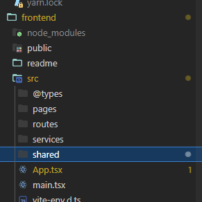

# TESTE REACT

Sistema disponível em: https://wswork-desafio-es.netlify.app/

## Organização de pastas
* @types: A pasta @types é onde estão localizados os nossos tipos globais.
* pages: A pasta pages é onde estão localizadas as páginas disponíveis no sistema e também seus subcomponentes..
* services: A pasta services é onde estão localizadas as funções que acessam sistemas externos como a nossa aplicação backend.
* shared: A pasta shared é onde estão localizados os componentes, constantes, utilitarios, estilos, contextos e hooks que podem ser reutilizados em diversas partes da aplicação.




## Como utilizar os componentes criados?
Para o uso dos componentes criados, basta conferir as interfaces definidas no próprio arquivo onde está localizado o componente:

```ts
interface props {
  editMode?: boolean;
  car?: car;
  handleClose: () => void;
  action: (data: carData) => Promise<Error | null>;
}

type fuel = "FLEX" | "DIESEL";

const currentDate = new Date();

const CarModal = ({ editMode, handleClose, action, car }: props) => {
```

## Como executar o projeto?

Primeiramente será necessário alterar a VITE_BASE_URL que está localizada no arquivo .env

```env 
VITE_BASE_URL="https://backend-java-car.onrender.com"
```
Após isto, é só executar o seguinte comando no terminal: 

```.sh
  npm run dev
```

## Tecnologias utilizadas
* ReactJs
* Typescript
* Styled-components
* Axios
* React-icons
